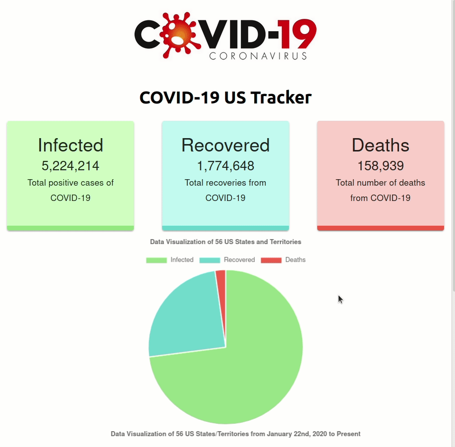
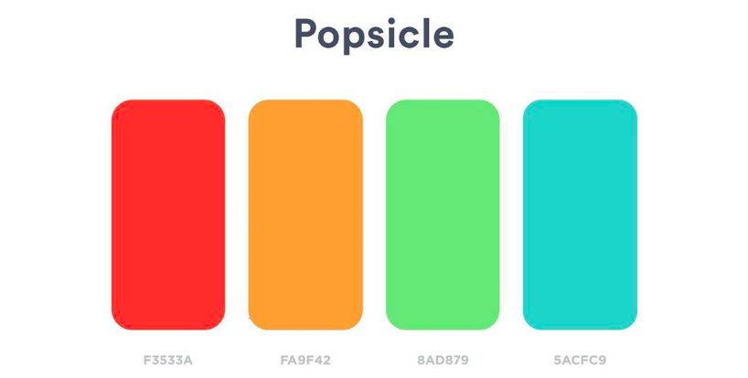

# COVID-19 Tracker in United States

Live Site (deployed on Heroku): https://covid19-us-tracker-visual.herokuapp.com/

## Demo GIF (As of August 17th, 2020)


## Description
A COVID-19 tracker that visualizes the statistics (total positive cases, recoveries, and deaths) of COVID-19 data in the United States provided by the [COVID Tracking Project API](https://covidtracking.com/data/api). This project will show the collective US data, the daily US data through a line chart, the collective data for each state, and the daily data for each state through a line chart. The API's US data is updated every day at 0:00 AM UTC (i.e. 5:00 PM PST). Each individual state data may not be updated every day.

Some states may have null values for some of their data, particularly a state's recovery number from COVID-19. In this case, I chose to update the data card for such null values with a '?' to indicate that it is unknown.

## COVID Tracking Project API
The documentation of the API used is linked [here](https://documenter.getpostman.com/view/8854915/SzS8rjHv?version=latest#dc323eaa-826d-4efc-bd3c-85d9d757477b). 

I make a GET request to 'http://covidtracking.com/api/us' to obtain the US Current data that I display on the data cards and the pie chart.
I make a GET request to 'http://covidtracking.com/api/us/daily' to obtain the US daily information that I display on the line graph.  
I make a GET request to 'https://covidtracking.com/api/states' to populate the selector options menu of states and to display any specific chosen state to the data cards and the pie chart.
I make a GET request to 'https://covidtracking.com/api/states/daily' to obtain the daily information for any specific chosen state to display on the line graph.

## Running Project Locally
There is the live site of this application deployed on Heroku as displayed on one of the first few lines of this README, but if you would rather run this application locally, then do the following:

* First clone the project
```
git clone https://github.com/KennethNguyen/COVID19-US-tracker
```

* Then go into the cloned project directory
```
cd COVID19-US-tracker
```

* In the cloned project directory, install any required dependencies and then run the project
```
npm install
npm start
```
By default, npm start will tell you to navigate to localhost:3000 (or another local server if port 3000 is occupied) on your browser to see the application

## Utilized
* React 
* @material-ui/core - React UI framework
    * View the official website [here](https://material-ui.com/)
* react-countup - React wrapper for CountUp.js
    * View the package [here](https://www.npmjs.com/package/react-countup)
* react-chartjs-2 - React wrapper for Chart.js
    * View the Github repo for react-chartjs-2 [here](https://github.com/jerairrest/react-chartjs-2) and the Chart.js library documentation [here](https://www.chartjs.org/docs/latest/).  
* This project was bootstrapped with [Create React App](https://github.com/facebook/create-react-app).

## Color Palette 
The color palette I chose for this project is called Popsicle from [this](https://digitalsynopsis.com/design/color-schemes-palettes-combinations/) post I found. It is number 37 on the list. This choice was inspired from the bold and vibrant red of the logo that I first found. Because of the logo, I knew I wanted to look for a similar vibrant red to reflect on the data of death cases to represent danger. I wanted to associate the data of recovered cases with a feeling of peace and safety, so I opted for a turquoise blue color as well. Finally I opted for a light green color to associate the number of positive cases with because I thought it reflects sickness and germs.



## Logo Credits
The coronavirus logo was taken from [York Graphic Designers](https://www.yorkgraphicdesigners.co.uk/coronavirus-covid-19-logo-design/). Check them out!

## Backlog
* ~~Options to choose each individual state/territory to display data for~~
    * ~~Render data cards, graphs, and titles of each option dynamically~~
* ~~Line graph of daily COVID-19 statistics~~ 
    * The graph on small (devices) viewport is cluttered and needs the height to be adjusted
* % change counter for each data
* Possibly buttons to switch between pie chart and line chart

## Author
Kenneth Nguyen
